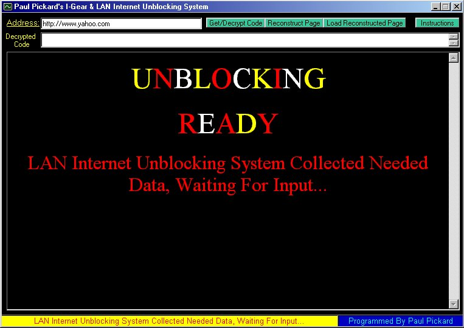



## Internet Unblocking System

### Description

This application allows you to access websites that have been blocked by network administrators and website filters that check for obscene words in pages when they pass throught the proxy. This app gets the html code of the website instead of the actual website itself then saves the file to disk and opens it from there. It does look complicated but is is ver easy to understand. If you like my code please vote for it, Thanks.
 
### More Info
 

             |
---                |---
**Submitted On**   |2001-04-30 21:12:16
**By**             |[Paul Pickard](https://github.com/Planet-Source-Code/PSCIndex/blob/master/ByAuthor/paul-pickard.md)
**Level**          |Intermediate
**User Rating**    |2.6 (21 globes from 8 users)
**Compatibility**  |VB 5\.0, VB 6\.0
**Category**       |[Complete Applications](https://github.com/Planet-Source-Code/PSCIndex/blob/master/ByCategory/complete-applications__1-27.md)
**World**          |[Visual Basic](https://github.com/Planet-Source-Code/PSCIndex/blob/master/ByWorld/visual-basic.md)
**Archive File**   |[Internet U190404302001\.zip](https://github.com/Planet-Source-Code/paul-pickard-internet-unblocking-system__1-22822/archive/master.zip)

